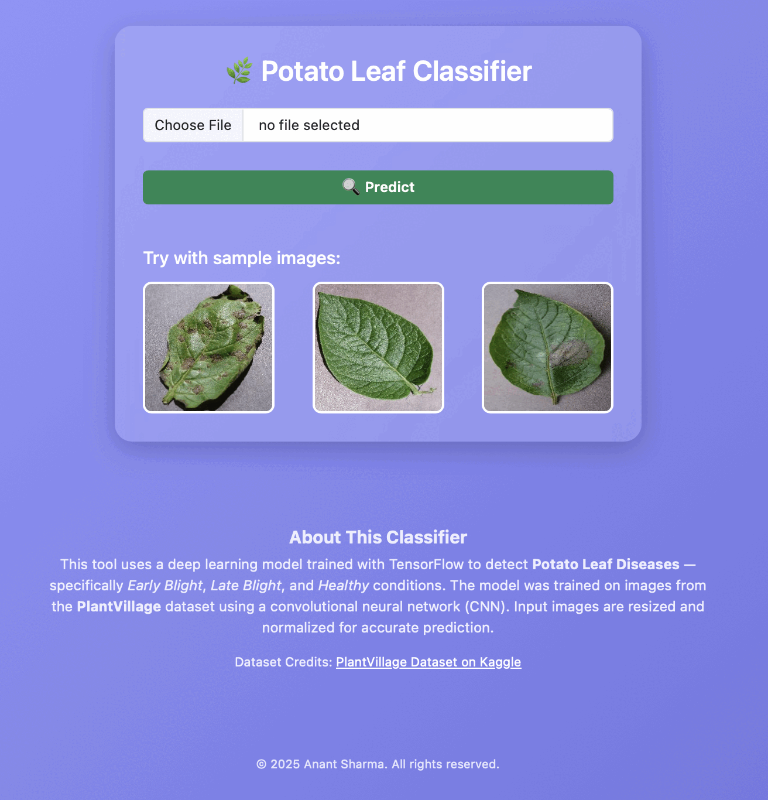

# Potato Leaf Disease Classification

This tool uses a convolutional neural network (CNN) implemented in TensorFlow and Keras to detect potato leaf diseases — specifically **Early Blight**, **Late Blight**, and **Healthy** conditions. The model was trained on images from the **PlantVillage dataset**, which provides a clean, high-quality dataset of leaf images captured in controlled environments.

## Dataset Description

- **Source**: Subset of potato leaf images from the PlantVillage dataset, sourced via [Mendeley Data](https://data.mendeley.com/datasets/tywbtsjrjv/1) (Pandian & Gopal, 2019, DOI: 10.17632/tywbtsjrjv.1), derived from the original [PlantVillage dataset](https://arxiv.org/abs/1511.08060) (Hughes & Salathé, 2015).
- **Format**: Directory-based image folders, 256 × 256 pixels.
- **Classes and Split**: 3 classes (Early Blight, Late Blight, Healthy); split: 80% training, 10% validation, 10% test.

## Training Configuration

The training pipeline is built using TensorFlow’s high-level Keras API. Key model and training configurations are as follows:

- **Model type**: Sequential CNN  
- **Loss function**: Sparse Categorical Crossentropy  
- **Optimizer**: Adam  
- **Evaluation metric**: Accuracy  
- **Epochs**: 50  
- **Batch size**: 32  

The model is trained using `model.fit()` on the training set and evaluated on a separate test set using `model.evaluate()`.

## Model Evaluation

The model is evaluated using TensorFlow's built-in `evaluate()` method on the test dataset after training. The accuracy is printed using:

```python
scores = model.evaluate(test_ds)
print(f"Test Accuracy: {round(scores[1], 4) * 100}%")
```

In addition, the training process logs accuracy and loss for both training and validation datasets, which are visualized using matplotlib:

```python
plt.plot(epochs_range, acc, label='Training Accuracy')
plt.plot(epochs_range, val_acc, label='Validation Accuracy')
plt.plot(epochs_range, loss, label='Training Loss')
plt.plot(epochs_range, val_loss, label='Validation Loss')
```

Note: The actual accuracy value is not stored or logged in the notebook output. It must be observed during runtime.

## Strengths and Limitations

### Strengths

- **Clean and Structured Dataset**: Utilizes the PlantVillage dataset, which is well-labeled and consistent.
- **Modular and Adaptable Code**: Easy to modify for other plant disease classification tasks.
- **Standard Best Practices**: Implements augmentation, caching, batching, and data partitioning.
- **Training Visualizations**: Plots training and validation accuracy/loss curves.
- **Beginner-Friendly**: Built using clear and high-level TensorFlow/Keras APIs.

### Limitations

- **No Fixed Evaluation Output**: Accuracy is printed but not recorded in the notebook.
- **Limited Metrics**: Only overall accuracy is used; no precision, recall, or confusion matrix.
- **Dataset Bias**: Limited to lab-quality images; not tested on real-world data.
- **No Deployment or Inference Benchmarking**: No tests for mobile or edge deployment scenarios.
- **No Error Analysis**: No insights into misclassifications or model weaknesses.

# Potato Leaf Disease Classifier Webapp

This is a lightweight web application that classifies potato leaf diseases using a deep learning model trained on the PlantVillage dataset. The tool can identify:

- Early Blight
- Late Blight
- Healthy Leaves

The application is optimized for both desktop and mobile users and supports image upload or direct camera capture.

---

## Live Demo

You can access the live version of this app here:  
**https://potato-disease-classifier-8ybu.onrender.com**

---

## Model Overview

- **Model Type**: Convolutional Neural Network (CNN)
- **Framework**: TensorFlow / Keras
- **Input Shape**: 224x224 RGB
- **Output Classes**: Early Blight, Late Blight, Healthy
- **Dataset**: PlantVillage Dataset

The model is saved as `potatoes.h5` and used for inference in the backend.

---
## Folder Structure
```text
potato-disease-classifier/
├── api/
│   ├── main.py               # FastAPI backend code
│   └── potatoes.h5           # Trained Keras model
├── templates/
│   ├── index.html            # Main frontend template
│   └── result.html           # (Optional) secondary result template
├── static/                   # Static assets (images, CSS, etc.)
├── Training/
│   ├── PotatoDiseaseNotebook.ipynb  # Training notebook
│   └── PlantVillage/                # Dataset directory
├── requirements.txt         # Python dependencies
└── README.md                # This file
```
---

## Technology Stack

| Component     | Technology           |
|---------------|----------------------|
| Frontend      | HTML, CSS (Bootstrap 5) |
| Backend       | FastAPI              |
| Machine Learning | TensorFlow / Keras |
| Deployment    | Render               |

---

MIT License

Copyright (c) 2025 Anant Sharma

Permission is hereby granted, free of charge, to any person obtaining a copy
of this software and associated documentation files (the "Software"), to deal
in the Software without restriction, including without limitation the rights
to use, copy, modify, merge, publish, distribute, sublicense, and/or sell
copies of the Software, and to permit persons to whom the Software is
furnished to do so, subject to the following conditions:

The above copyright notice and this permission notice shall be included in all
copies or substantial portions of the Software.

THE SOFTWARE IS PROVIDED "AS IS", WITHOUT WARRANTY OF ANY KIND, EXPRESS OR
IMPLIED, INCLUDING BUT NOT LIMITED TO THE WARRANTIES OF MERCHANTABILITY,
FITNESS FOR A PARTICULAR PURPOSE AND NONINFRINGEMENT. IN NO EVENT SHALL THE
AUTHORS OR COPYRIGHT HOLDERS BE LIABLE FOR ANY CLAIM, DAMAGES OR OTHER
LIABILITY, WHETHER IN AN ACTION OF CONTRACT, TORT OR OTHERWISE, ARISING FROM,
OUT OF OR IN CONNECTION WITH THE SOFTWARE OR THE USE OR OTHER DEALINGS IN THE
SOFTWARE.


